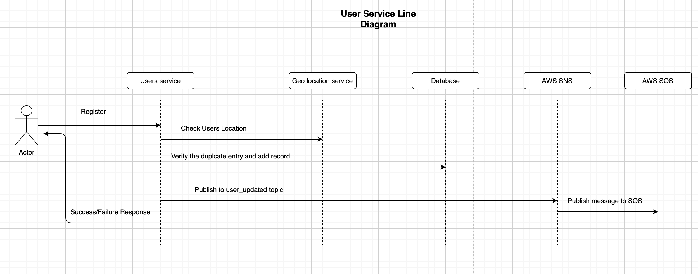

# users-service-nestjs

## Description

A user service small service written in Node using nest JS framework.
This project is built with [NestJS](https://nestjs.com/).
Reading the documentation can really help in understanding the structure of this repo.

## Line Diagram



## Pre-requisites

1.  [NodeJS](https://nodejs.org/en/download/)
2.  [Docker](https://docs.docker.com/docker-for-mac/)
3.  [Nest CLI](https://docs.nestjs.com/cli/overview)

## Installation

```bash
$ npm install
```

## Running the app

### Note

While running locally, IP address will be detected as `::1` which is reserved IP and we might not get the geolocation.
To work around, we can pass `X-Client-IP` header to use this IP for geolocation details.
ex: `X-Client-IP: 31.10.147.174`

To run the application locally. Start the local database server and then run the applications.

```bash
# development
$ npm run start

# create a local db
$ npm run start:local:db

# watch mode
$ npm run start:dev

# production mode
$ npm run start:prod
```

### Running via Docker-compose

```bash
# to run in the foreground
$ docker-compose up

# to run in the background and
$ docker-compose up -d

# tail the logs
$ docker-compose logs -f

# subsequent builds for any changes in dockerfile.
$ docker-compose build
```

## Test

```bash
# unit tests
$ npm run test

# e2e tests
$ npm run test:e2e

# test coverage
$ npm run test:cov

```

## API documentation

### Compdoc

It uses [Compodoc](https://compodoc.app/guides/getting-started.html) to generate the static documents.
On start of the service Static documents will be served. It can be accessed on the browser on the root path.

```bash
http://localhost
```

### Swagger

Swagger documentation can be found at:

```bash
http://localhost/swagger/
```

## TODO's

1. Rate limit
2. Pagination on Get users
3. API timeout
4. Password hashing (It can be done using chkpass extension)
5. Cache results
6. Allow search for more than one email or first_name
7. Tests

Note: Having some trouble in fixing docker SNS due to certificate isssue, hence that code is commented. But having real AWS SNS, it shall work with ease.
